# Detección de Malaria mediante Supervised Contrastive Learning y Modelos Clásicos: Metodología y Resultados

**Materia:** Modelos II
**Autor:** Juan Barrientos
**Fecha:** 26 de mayo de 2026
**Repositorio:** `Malaria-Dectetion-Deeplearning`

---

## Índice

1. [Metodología](#1-metodología)
   - [1.1 Dataset y preparación](#11-dataset-y-preparación)
   - [1.2 Aumentaciones para entrenamiento contrastivo](#12-aumentaciones-para-entrenamiento-contrastivo)
   - [1.3 Arquitectura del encoder contrastivo](#13-arquitectura-del-encoder-contrastivo)
   - [1.4 Función de pérdida: Supervised Contrastive Loss](#14-función-de-pérdida-supervised-contrastive-loss)
   - [1.5 Procedimiento de entrenamiento del encoder](#15-procedimiento-de-entrenamiento-del-encoder)
   - [1.6 Extracción de embeddings](#16-extracción-de-embeddings)
   - [1.7 Modelos clásicos sobre embeddings](#17-modelos-clásicos-sobre-embeddings)
   - [1.8 Reducción de dimensión y análisis de features](#18-reducción-de-dimensión-y-análisis-de-features)
   - [1.9 Métricas y validación estadística](#19-métricas-y-validación-estadística)
   - [1.10 Reproducibilidad](#110-reproducibilidad)
2. [Resultados](#2-resultados)
   - [2.1 Caracterización del dataset (EDA)](#21-caracterización-del-dataset-eda)
   - [2.2 Entrenamiento contrastivo](#22-entrenamiento-contrastivo)
   - [2.3 Calidad geométrica de los embeddings](#23-calidad-geométrica-de-los-embeddings)
   - [2.4 Reducción dimensional](#24-reducción-dimensional)
   - [2.5 Modelos clásicos sobre embeddings de 1024 dimensiones](#25-modelos-clásicos-sobre-embeddings-de-1024-dimensiones)
   - [2.6 Impacto de la reducción de dimensión](#26-impacto-de-la-reducción-de-dimensión)
   - [2.7 Análisis de vecinos más cercanos](#27-análisis-de-vecinos-más-cercanos)
   - [2.8 Comparación consolidada y resumen final](#28-comparación-consolidada-y-resumen-final)

---

## 1. Metodología

El estudio aborda la clasificación binaria de imágenes de frotis sanguíneo en dos clases — *Parasitized* (células infectadas por *Plasmodium*) y *Uninfected* (sanas) — mediante una arquitectura de dos etapas: primero un encoder convolucional entrenado con pérdida contrastiva supervisada (SupCon, Khosla et al. 2020), y luego cinco clasificadores estadísticos clásicos entrenados sobre los embeddings producidos por dicho encoder. Esta separación entre aprendizaje de representaciones y clasificador final permite una comparación justa de los algoritmos sobre un mismo espacio de características, y aísla el aporte del entrenamiento contrastivo frente al del clasificador.

### 1.1 Dataset y preparación

Se utilizó el dataset público *Cell Images for Detecting Malaria* (Kaggle, autor `iarunava`), compuesto por **27 558 imágenes RGB** de células sanguíneas adquiridas con microscopía óptica, distribuidas de forma equilibrada entre las dos clases (13 779 *Parasitized* y 13 779 *Uninfected*). La etiqueta binaria es $y \in \{0, 1\}$ con $0 =$ *Uninfected* y $1 =$ *Parasitized*.

Las imágenes presentan variabilidad natural en tamaño (rango aproximado $80 \times 80$ a $200 \times 200$ píxeles). Todas se redimensionaron a un tamaño canónico de $96 \times 96$ píxeles mediante `torchvision.transforms.Resize`, y se normalizaron canal a canal usando las estadísticas estándar de ResNet:

$$\mu = (0.485,\, 0.456,\, 0.406), \qquad \sigma = (0.229,\, 0.224,\, 0.225).$$

Esta normalización es coherente con el preentrenamiento ResNet del backbone (ver §1.3). Antes de cualquier operación se verificó la integridad del dataset: **0 archivos corruptos** detectados sobre las 27 558 imágenes.

El conjunto se dividió mediante muestreo estratificado por clase (semilla `seed = 42`) en tres particiones:

| Partición | $N$ imágenes | *Parasitized* | *Uninfected* |
|-----------|-------------:|--------------:|-------------:|
| Train (70 %) | 19 290 | 9 645 | 9 645 |
| Val (15 %)   |  4 133 | 2 067 | 2 066 |
| Test (15 %)  |  4 135 | 2 067 | 2 068 |

La estratificación garantiza balance exacto 50/50 en cada split, eliminando la necesidad de técnicas de remuestreo (oversampling o pesos de clase) y permitiendo interpretar la accuracy global como métrica no sesgada.

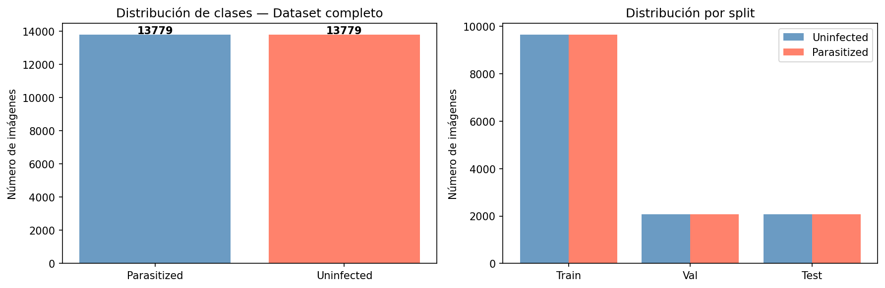
**Figura 1.** Distribución de las dos clases en el dataset completo y dentro de cada partición. El balance perfecto 50/50 se preserva tras la estratificación.

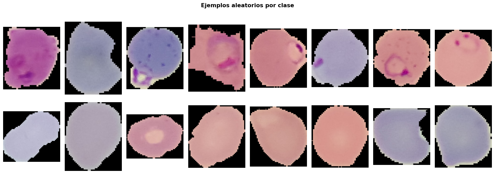
**Figura 2.** Muestras representativas por clase. La diferencia visual principal es la presencia de la mancha violácea del *Plasmodium* en las células infectadas.

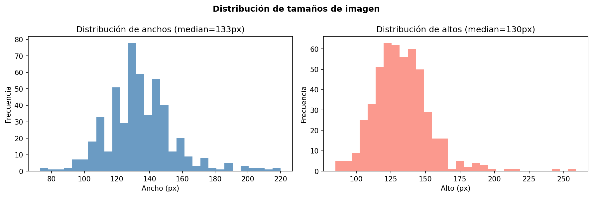
**Figura 3.** Histograma 2D (ancho × alto) sobre una muestra aleatoria de 500 imágenes. La heterogeneidad original justifica el resize a $96 \times 96$.

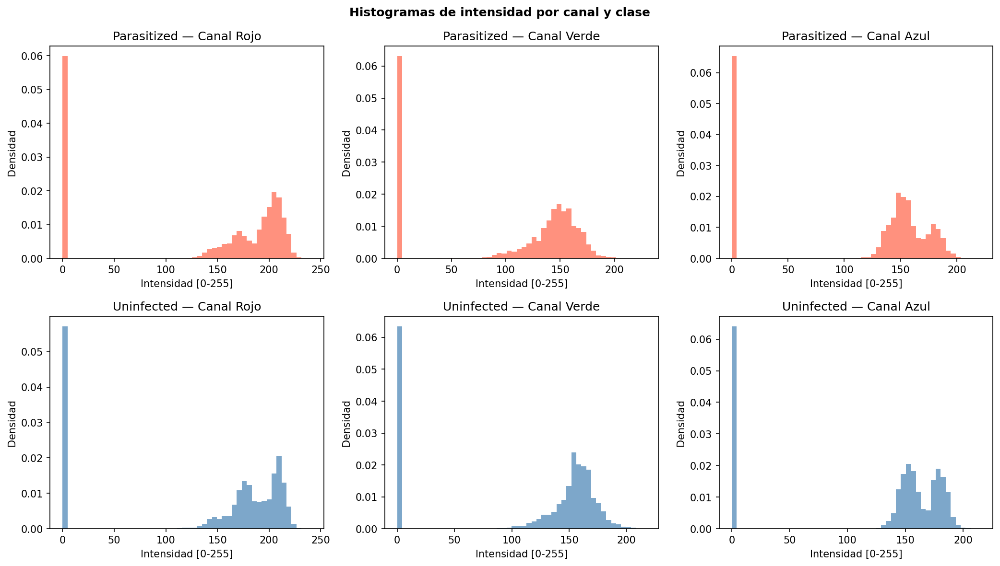
**Figura 4.** Histogramas de intensidad por canal R, G, B. Predominio del canal rojo (eritrocitos teñidos con Giemsa).

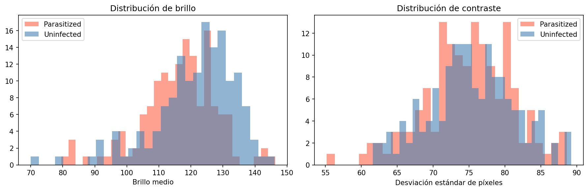
**Figura 5.** Distribuciones de brillo medio y contraste (desviación estándar de intensidad) por clase. Las distribuciones se solapan, lo que indica que la discriminación no puede apoyarse únicamente en estadísticos globales de intensidad.

### 1.2 Aumentaciones para entrenamiento contrastivo

Para el entrenamiento del encoder se aplicó una cadena de augmentaciones estocásticas implementada en `src/data/augmentations.py::get_contrastive_transform`. Cada llamada al *dataset* `SupConPairDataset` genera dos vistas independientes $v_1, v_2$ de la misma imagen $x$, lo que produce un batch efectivo de $2N$ muestras a partir de $N$ imágenes originales.

La cadena completa de transformaciones es:

1. `RandomResizedCrop(96, scale=(0.7, 1.0))` — recorte aleatorio con escala uniforme en $[0.7, 1.0]$ y reescalado a $96 \times 96$.
2. `RandomHorizontalFlip(p=0.5)`.
3. `RandomVerticalFlip(p=0.5)` — las células carecen de orientación canónica.
4. `RandomRotation(degrees=15)` — rotación uniforme en $[-15°, +15°]$.
5. `ColorJitter(brightness=0.2, contrast=0.2, saturation=0.2, hue=0.0)` — el matiz se mantiene fijo (`hue = 0.0`) para preservar el color violáceo característico del parásito.
6. `RandomApply([GaussianBlur(kernel_size=3, sigma∈[0.1, 1.0])], p=0.3)`.
7. `ToTensor` + `Normalize` con las estadísticas ResNet de §1.1.

Se omitieron deliberadamente operaciones de oclusión agresiva (*Cutout*, *GridMask*, *RandomErasing*) porque pueden borrar accidentalmente la región del parásito — la entidad diagnóstica — y degradar la señal supervisada.

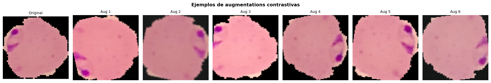
**Figura 6.** Seis vistas independientes generadas a partir de una misma imagen mediante la cadena de augmentaciones contrastivas. Todas conservan la presencia (o ausencia) del parásito.

### 1.3 Arquitectura del encoder contrastivo

El modelo `ContrastiveEncoder` (`src/models/encoder.py`) está compuesto por tres bloques secuenciales:

```
Imagen RGB (3 x 96 x 96)
        │
        ▼
┌────────────────────────────┐
│  Backbone: ResNet18        │   pretrained=ImageNet1K_V1
│  fc.in_features = 512      │   resnet.fc <- nn.Identity()
└────────────────────────────┘
        │  h  ∈ R^512
        ▼
┌────────────────────────────┐
│  encoder_head              │
│  Linear(512 -> 1024)       │
│  BatchNorm1d(1024)         │
│  ReLU(inplace)             │
└────────────────────────────┘
        │  z  ∈ R^1024   <-- embedding final (downstream)
        ▼                    (no se normaliza L2)
┌────────────────────────────┐
│  proj_head                 │   sólo durante el entrenamiento SupCon
│  Linear(1024 -> 512)       │
│  BatchNorm1d(512) + ReLU   │
│  Linear(512 -> 128)        │
│  F.normalize(·, dim=1)     │
└────────────────────────────┘
        │  p  ∈ S^{127}   <-- proyección L2-normalizada
        ▼                    (entra al SupCon loss)
```

Justificación de las decisiones de diseño:

- **Backbone ResNet18 preentrenado en ImageNet.** Aporta filtros convolucionales de bajo nivel ya útiles (bordes, texturas, manchas) y reduce la demanda de cómputo y datos. Se reemplaza la capa `fc` original por `nn.Identity()` para exponer la representación de 512 dimensiones de la última capa de *average pooling*.
- **`encoder_head`: expansión a 1024 dimensiones.** El embedding *downstream* se sitúa deliberadamente en un espacio de mayor dimensionalidad que la salida cruda de ResNet18 (512), siguiendo la recomendación empírica de Chen et al. (2020) y Khosla et al. (2020) según la cual la representación previa al *projection head* es más rica que la salida directa del backbone.
- **`proj_head`: proyección a $S^{127}$ (esfera unidad en $\mathbb{R}^{128}$).** Sólo se usa durante el cómputo de la pérdida contrastiva: la normalización L2 convierte el producto interno en similitud coseno (ver §1.4), y la dimensión 128 reduce la presión de memoria. Tras el entrenamiento, este bloque se descarta y se utiliza únicamente `encoder_head` para producir embeddings *downstream*.

El método `model.get_embedding(x)` ejecuta `forward(x, return_embedding=True)` bajo `torch.no_grad()` y devuelve $z \in \mathbb{R}^{1024}$ sin normalizar.

### 1.4 Función de pérdida: Supervised Contrastive Loss

La pérdida contrastiva supervisada implementada en `src/training/contrastive_loss.py::SupConLoss` corresponde a la ecuación 2 del trabajo original de Khosla et al. (2020):

$$
\mathcal{L}_{\text{SupCon}}
\;=\;
\sum_{i \in I} \frac{-1}{|P(i)|}
\sum_{p \in P(i)}
\log
\frac{\exp\bigl(z_i \cdot z_p / \tau\bigr)}
{\displaystyle\sum_{a \in A(i)} \exp\bigl(z_i \cdot z_a / \tau\bigr)}
$$

Las definiciones de los conjuntos y símbolos son:

- $I = \{1, 2, \dots, 2N\}$ es el conjunto de índices del batch multi-vista (cada imagen aporta dos vistas, ver §1.2).
- $A(i) = I \setminus \{i\}$ es el conjunto de "ancla" sin el propio índice.
- $P(i) = \{p \in A(i) : y_p = y_i\}$ es el conjunto de positivos respecto al ancla $i$ (incluye la segunda vista de $i$ y todas las demás imágenes del batch que comparten su etiqueta).
- $z_i \in S^{127}$ es la proyección L2-normalizada producida por `proj_head`; por lo tanto $\|z_i\|_2 = 1$ y se cumple

$$z_i \cdot z_p \;=\; \cos\theta_{ip} \in [-1, 1].$$

- $\tau \in \mathbb{R}_{>0}$ es la **temperatura**, fijada a $\tau = 0.07$ (valor estándar en SimCLR/SupCon). Temperaturas más bajas concentran la distribución softmax y endurecen el contraste.

Intuitivamente, la pérdida maximiza la similitud coseno entre el ancla y todas sus contrapartes positivas (mismo $y$), relativa a la similitud frente al resto del batch. A diferencia de la pérdida de entropía cruzada estándar, no requiere un clasificador final ni una codificación *one-hot* fija: organiza el espacio latente como agrupamientos densos por clase.

**Implementación.** El cálculo en `SupConLoss.forward` sigue cinco pasos, con estabilización numérica explícita:

1. **Matriz de similitud escalada.** Sea $Z \in \mathbb{R}^{N \times D}$ la matriz de proyecciones del batch (ya L2-normalizadas). Se calcula

$$S = \frac{1}{\tau}\, Z Z^{\top} \;\in\; \mathbb{R}^{N \times N}.$$

2. **Máscaras booleanas.** La máscara diagonal $D = \neg I_N$ excluye la auto-similitud $S_{ii}$. La máscara de positivos $M \in \{0,1\}^{N \times N}$ se define como

$$M_{ij} = \mathbb{1}[y_i = y_j] \;\wedge\; D_{ij}.$$

3. **Estabilización log-sum-exp.** Para cada fila $i$ se resta el máximo (ignorando la diagonal) antes de exponenciar:

$$\tilde S_{ij} = S_{ij} - \max_{k \neq i} S_{ik}.$$

Esto evita *overflow* sin alterar el resultado, dado que la sustracción se cancela en el cociente softmax.

4. **Log-probabilidades.** Tras la sustracción se computa

$$\log P_{ij} \;=\; \tilde S_{ij} - \log \!\!\sum_{a \in A(i)} \exp(\tilde S_{ia}) \;+\; \epsilon,$$

con $\epsilon = 10^{-8}$ para evitar $\log 0$ en la suma del denominador.

5. **Promedio sobre positivos por fila y promedio global.** Sea $|P(i)|$ el número de positivos de la fila $i$ e $I_v = \{i : |P(i)| > 0\}$ el conjunto de filas válidas. La pérdida final es

$$\mathcal{L} \;=\; -\frac{1}{|I_v|} \sum_{i \in I_v} \frac{1}{|P(i)|} \sum_{p \in P(i)} \log P_{ip}.$$

En el caso degenerado en que el batch no contiene ningún par positivo, la implementación retorna $0$ como pérdida (paso de gradiente nulo). Este caso no se materializa con un batch balanceado de tamaño 256 sobre dos clases.

### 1.5 Procedimiento de entrenamiento del encoder

El entrenamiento sigue el bucle estándar de SupCon, definido en `src/training/train_contrastive.py`:

| Hiperparámetro | Valor | Origen |
|----------------|-------|--------|
| Optimizador | AdamW | `configs/contrastive.yaml::optimizer.name` |
| Learning rate inicial $\eta_0$ | $10^{-3}$ | `optimizer.lr` |
| Weight decay $\lambda$ | $10^{-4}$ | `optimizer.weight_decay` |
| Scheduler | CosineAnnealingLR | `scheduler.name` |
| $\eta_{\min}$ | $10^{-5}$ | `scheduler.eta_min` |
| Épocas máximas | 50 | `training.epochs` |
| Batch size (GPU T4) | 256 | `training.batch_size_gpu` |
| `early_stopping_patience` | 7 | `training.early_stopping_patience` |
| Mixed precision | activado en GPU | `torch.cuda.amp.autocast` |
| Temperatura $\tau$ | 0.07 | `loss.temperature` |

El *dataset* contrastivo `SupConPairDataset` retorna tripletes $(v_1, v_2, y)$ por cada índice solicitado. En cada paso de optimización las dos vistas se concatenan a lo largo de la dimensión de batch:

$$\text{views} = [v_1 \,\Vert\, v_2] \in \mathbb{R}^{2N \times 3 \times 96 \times 96},
\qquad
\text{labels} = [y \,\Vert\, y] \in \mathbb{R}^{2N},$$

y se pasan en un único *forward* al modelo, que devuelve las proyecciones normalizadas $Z = \text{model}(\text{views}) \in \mathbb{R}^{2N \times 128}$. La pérdida se calcula como $\mathcal{L} = \text{SupConLoss}(Z, \text{labels})$.

En GPU se utiliza precisión mixta (`torch.cuda.amp.autocast` + `GradScaler`) para reducir uso de VRAM y acelerar el cómputo. El *scheduler* avanza una vez por época.

**Checkpoint y *early stopping*.** Se guardan dos artefactos en `artifacts/checkpoints/`:

- `encoder_best.pt` — modelo con menor `val_loss` observada.
- `encoder_last.pt` — modelo de la última época ejecutada.

Si la `val_loss` no mejora durante 7 épocas consecutivas, el entrenamiento se detiene anticipadamente.

### 1.6 Extracción de embeddings

Una vez convergido el encoder, los embeddings de las tres particiones se extraen offline mediante `model.get_embedding`, que ejecuta el *forward* hasta `encoder_head` y descarta `proj_head`. La salida es un tensor $z \in \mathbb{R}^{1024}$ **sin normalizar** (i.e. con activaciones ReLU positivas en $[0, +\infty)$).

Los embeddings se persisten como arrays NumPy `float32` en `data/embeddings/`:

| Split | `X.npy` shape | `y.npy` shape |
|-------|---------------|---------------|
| train | $(19\,290,\, 1024)$ | $(19\,290,)$ |
| val   | $(4\,133,\, 1024)$ | $(4\,133,)$ |
| test  | $(4\,135,\, 1024)$ | $(4\,135,)$ |

El rango observado en los arrays es aproximadamente $[0, 8.875]$, consistente con activaciones ReLU.

### 1.7 Modelos clásicos sobre embeddings

Sobre los embeddings de 1024 dimensiones se entrenan cinco clasificadores estadísticos clásicos implementados en *scikit-learn*. Todos se envuelven en un `Pipeline(StandardScaler → modelo)` para garantizar consistencia de escala entre features. La búsqueda de hiperparámetros se realiza con `GridSearchCV` (`cv = 3` *folds* estratificados, scoring `f1_macro`) sobre la concatenación $X_{\text{trainval}} = X_{\text{train}} \cup X_{\text{val}}$.

**a) Regresión logística.** Modelo lineal probabilístico para clasificación binaria:

$$P(y = 1 \mid x) \;=\; \sigma\!\bigl(w^{\top} x + b\bigr), \qquad \sigma(t) = \frac{1}{1+e^{-t}}.$$

Se minimiza la log-verosimilitud penalizada con regularización L2:

$$\min_{w,\,b} \;\; \frac{1}{2 C}\|w\|_2^{2} \;-\; \sum_{i=1}^{N} \bigl[\, y_i \log p_i + (1 - y_i) \log(1 - p_i)\,\bigr],$$

con $p_i = \sigma(w^{\top}x_i + b)$. Grid: $C \in \{0.1, 1.0\}$, `penalty="l2"`, solver `lbfgs`, `max_iter = 1000`.

**b) $k$-Nearest Neighbors.** Predicción por voto mayoritario entre los $k$ vecinos más cercanos en el conjunto de entrenamiento, usando distancia coseno

$$d_{\cos}(x, x') \;=\; 1 - \frac{x \cdot x'}{\|x\|_2 \|x'\|_2}.$$

Grid: $k \in \{5, 11\}$, pesos uniformes, métrica `cosine`.

**c) Random Forest.** Ensamble de árboles de decisión entrenados por *bagging*. La predicción es el voto mayoritario de $T$ árboles, cada uno ajustado sobre una muestra *bootstrap* del entrenamiento y eligiendo en cada nodo un subconjunto aleatorio de features. Grid: $T = 100$, $\text{max\_depth} \in \{10, 20\}$, $\text{min\_samples\_leaf} \in \{1, 2\}$.

**d) MLP de scikit-learn.** Red feedforward con una capa oculta de 256 unidades y activación ReLU:

$$h = \text{ReLU}(W_1 x + b_1), \qquad \hat y = \text{softmax}(W_2 h + b_2).$$

Entrenada con Adam, regularización L2 $\alpha$ y *early stopping* sobre una validación interna del 10 %. Grid: hidden_layer_sizes $= [256]$, $\alpha = 10^{-4}$, $\eta_0 = 10^{-3}$, `max_iter = 200`.

**e) Support Vector Machine (kernel lineal).** Resuelve el problema primal de margen suave:

$$\min_{w,\,b,\,\xi} \;\; \tfrac{1}{2}\|w\|_2^{2} + C \sum_{i=1}^{N} \xi_i$$

sujeto a $y_i (w^{\top} x_i + b) \geq 1 - \xi_i$, $\xi_i \geq 0$ (con etiquetas $y_i \in \{-1, +1\}$ tras remapeo interno). Grid: $C \in \{0.1, 1.0\}$, kernel lineal, $\gamma = \text{scale}$, `probability=False`. La decisión final es $\hat y = \mathbb{1}[w^{\top} x + b > 0]$; al desactivar `probability` no se calibran *scores* y por lo tanto no se reporta AUC para SVM.

### 1.8 Reducción de dimensión y análisis de features

**PCA.** El análisis de componentes principales se aplica sobre $X_{\text{train}}$ centrado, descomponiendo la matriz de covarianza mediante SVD. Se selecciona el menor $k$ tal que la varianza acumulada supere el umbral del 95 %:

$$\frac{\sum_{i=1}^{k} \lambda_i}{\sum_{i=1}^{D} \lambda_i} \;\geq\; 0.95,
\qquad
D = 1024.$$

Los embeddings se proyectan a $\mathbb{R}^{k}$ con `whiten = False` y se reevalúan los dos mejores modelos (regresión logística y SVM) sobre este espacio reducido.

**UMAP.** *Uniform Manifold Approximation and Projection* (McInnes et al. 2018) construye un grafo $k$-NN ponderado en el espacio original y aprende un *embedding* de baja dimensión $\phi: \mathbb{R}^{1024} \to \mathbb{R}^{d}$ que aproxima la distribución de vecindades. La función objetivo es la entropía cruzada entre la matriz de probabilidades de adyacencia en el espacio original $p_{ij}$ y la correspondiente en el espacio reducido $q_{ij}$:

$$\mathcal{L}_{\text{UMAP}} \;=\; \sum_{i \neq j} \Bigl[\, p_{ij} \log \tfrac{p_{ij}}{q_{ij}} + (1 - p_{ij}) \log \tfrac{1 - p_{ij}}{1 - q_{ij}} \Bigr].$$

Parámetros: $n_{\text{neighbors}} = 15$, $\text{min\_dist} = 0.1$, métrica coseno, $d = 2$ para visualización.

**Análisis de features individuales.** Para identificar qué dimensiones de los embeddings son más discriminativas se computa la correlación punto-biserial $r_{pb}$ entre cada feature $X_{\cdot,j}$ y la etiqueta binaria $y$:

$$r_{pb} \;=\; \frac{\mu_1 - \mu_0}{s} \cdot \sqrt{\frac{n_1 n_0}{n^2}},$$

donde $\mu_k$, $n_k$ son la media y el tamaño del grupo $k$, y $s$ es la desviación estándar global del feature. El score se combina con la varianza individual para producir un ranking, y se grafican las 50 dimensiones más discriminativas.

### 1.9 Métricas y validación estadística

Para cada modelo se reportan, sobre las tres particiones:

- Accuracy $= \dfrac{1}{N}\sum \mathbb{1}[\hat y_i = y_i]$.
- Balanced accuracy $= \tfrac{1}{2}\bigl(\text{Recall}_0 + \text{Recall}_1\bigr)$.
- $F_1$-macro $= \tfrac{1}{2}(F_1^{(0)} + F_1^{(1)})$ y $F_1$-weighted.
- Precision-macro y Recall-macro.
- ROC-AUC para la clase positiva (cuando el modelo expone `predict_proba`).
- Matriz de confusión $2 \times 2$.

**Intervalos de confianza bootstrap.** Para el split de test se calcula un IC bootstrap percentil al 95 % siguiendo `src/evaluation/metrics.py::bootstrap_ci`. Con `n_resamples = 200` (`configs/classical.yaml::bootstrap.n_resamples`), `random_state = 42` y `confidence = 0.95`, el procedimiento es:

1. Para $b = 1, \dots, B$ con $B = 200$:
   - Muestrear con reemplazo $N$ índices del test, generando $(y_{\text{true}}^{(b)}, y_{\text{pred}}^{(b)})$.
   - Calcular accuracy, $F_1$-macro, balanced accuracy y AUC sobre la réplica.
2. Para cada métrica $m$:

$$\overline{m} = \tfrac{1}{B}\sum_b m^{(b)},
\qquad
\text{CI}_{95\%}(m) = [\, q_{2.5}(\{m^{(b)}\}),\; q_{97.5}(\{m^{(b)}\}) \,],$$

con $q_\alpha(\cdot)$ el percentil empírico. Los resultados se almacenan en el campo `bootstrap_ci_95` de cada archivo JSON de métricas.

**Análisis de similitud coseno.** Para cuantificar la calidad geométrica de los embeddings se calculan las distribuciones de similitud coseno intra-clase e inter-clase sobre un subconjunto aleatorio (semilla 42) de hasta 500 muestras del test (`src/evaluation/similarity.py`):

$$\text{intra} = \{\,\cos(z_i, z_j) : y_i = y_j,\; i < j\,\},
\qquad
\text{inter} = \{\,\cos(z_i, z_j) : y_i \neq y_j\,\}.$$

La separabilidad geométrica se resume con el *gap* $\Delta = \mu_{\text{intra}} - \mu_{\text{inter}}$.

### 1.10 Reproducibilidad

Todas las fuentes de aleatoriedad se fijan globalmente al inicio de cada script mediante `src/utils/seed.py::set_global_seed(seed = 42)`, que actúa sobre:

- `random.seed`, `numpy.random.seed`, `torch.manual_seed`, `torch.cuda.manual_seed_all`.
- `os.environ["PYTHONHASHSEED"] = "42"`.
- `torch.backends.cudnn.deterministic = True`, `torch.backends.cudnn.benchmark = False`.

Los splits CSV resultantes se versionan en `data/processed/` y los hiperparámetros completos viven en YAMLs versionados en `configs/`. Esta combinación permite reproducir exactamente los splits, las trayectorias de optimización y los resultados finales.

---

## 2. Resultados

### 2.1 Caracterización del dataset (EDA)

El análisis exploratorio confirma las propiedades requeridas para un entrenamiento supervisado robusto:

- **Cardinalidad:** 27 558 imágenes, 13 779 por clase (balance exacto).
- **Integridad:** 0 archivos corruptos detectados sobre el dataset completo.
- **Particiones estratificadas:** train 19 290 | val 4 133 | test 4 135, manteniendo el balance 50/50 en cada una.
- **Variabilidad visual:** las distribuciones de brillo y contraste por clase se solapan (Figura 5), lo que descarta soluciones basadas únicamente en estadísticos globales de intensidad y motiva el uso de representaciones aprendidas.

### 2.2 Entrenamiento contrastivo

El encoder ResNet18 + `encoder_head` + `proj_head` se programó entrenarse durante 50 épocas en una GPU NVIDIA Tesla T4 (Google Colab) con batch efectivo de $2 \cdot 256 = 512$ vistas por paso. La trayectoria de la pérdida SupCon se muestra en la Figura 7:

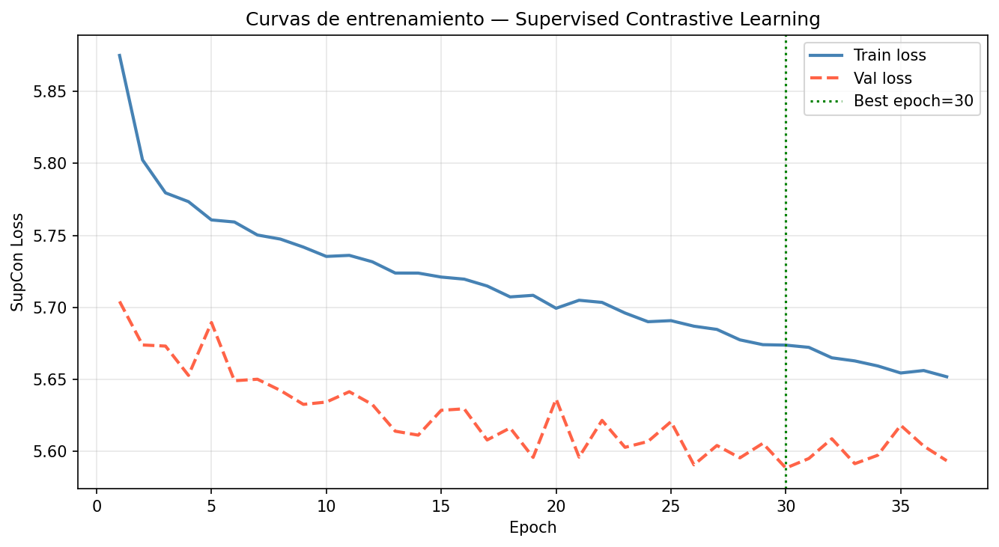
**Figura 7.** Pérdida SupCon en *train* y *val* por época durante el entrenamiento del encoder.

El mejor checkpoint (`encoder_best.pt`, 147.7 MB) corresponde a la **época 30** con `val_loss = 5.5883`. A partir de ese punto la pérdida de validación deja de mejorar y el *early stopping* termina la ejecución antes de las 50 épocas.

### 2.3 Calidad geométrica de los embeddings

Tras descartar `proj_head`, los embeddings de 1024 dimensiones exhiben una estructura altamente discriminativa. La Figura 8 muestra las distribuciones de similitud coseno intra-clase e inter-clase sobre una muestra aleatoria de 500 imágenes del test:

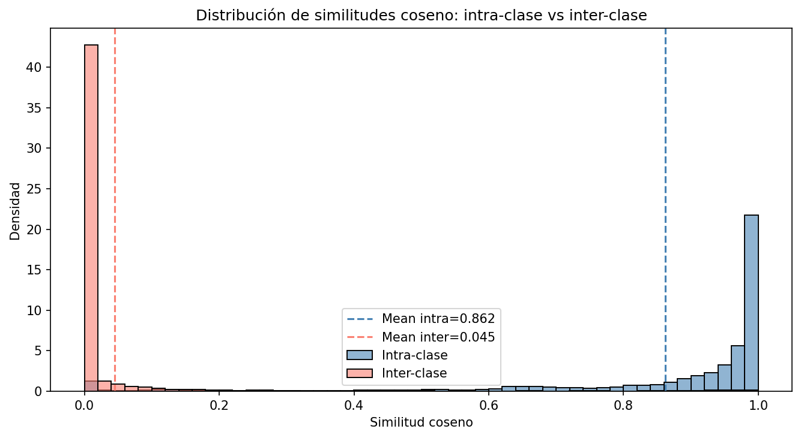
**Figura 8.** Histogramas de similitud coseno intra-clase (mismo $y$) vs. inter-clase (distinto $y$) en el espacio de embeddings de 1024 D.

Los estadísticos resumidos son:

| Distribución | Media $\mu$ | Desviación $\sigma$ |
|--------------|------------:|--------------------:|
| Intra-clase  | **0.8616**  | 0.2382 |
| Inter-clase  | **0.0446**  | 0.1605 |

El *gap* de separabilidad es

$$\Delta \;=\; \mu_{\text{intra}} - \mu_{\text{inter}} \;=\; 0.8170,$$

valor que indica una separación marcada entre clases bajo la métrica coseno.

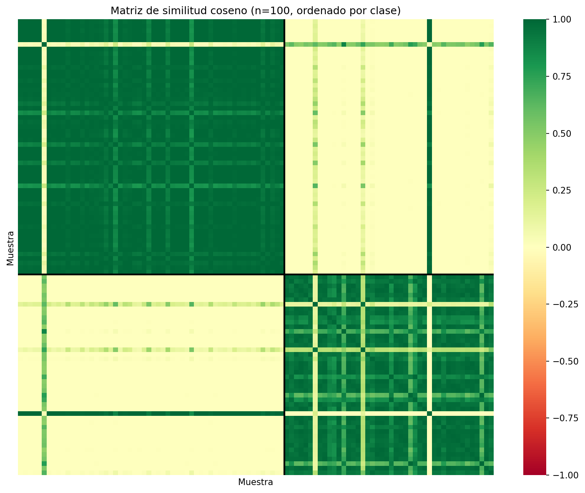
**Figura 9.** Matriz de similitud coseno sobre 100 imágenes de test ordenadas por clase. Los dos bloques diagonales (intra-clase) son uniformemente cercanos a 1, mientras que los bloques fuera de la diagonal (inter-clase) son visiblemente más oscuros.

El análisis de discriminabilidad por dimensión identifica un subconjunto reducido de features especialmente informativas:

- **Top-5 features más discriminativas:** índices `[269, 729, 827, 208, 625]`.
- **Discriminabilidad media (Top-50):** 0.8538.

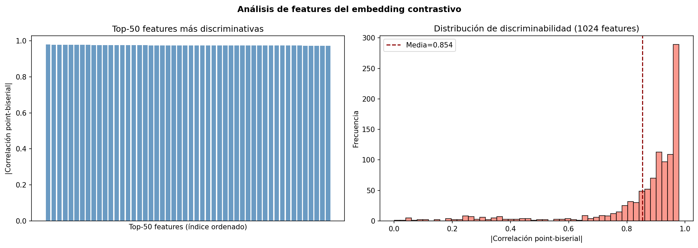
**Figura 10.** Score de discriminabilidad (correlación punto-biserial) de las 50 dimensiones más informativas de los embeddings.

### 2.4 Reducción dimensional

**PCA.** Al aplicar PCA sobre $X_{\text{train}}$ se observa que la varianza se concentra en muy pocos componentes:

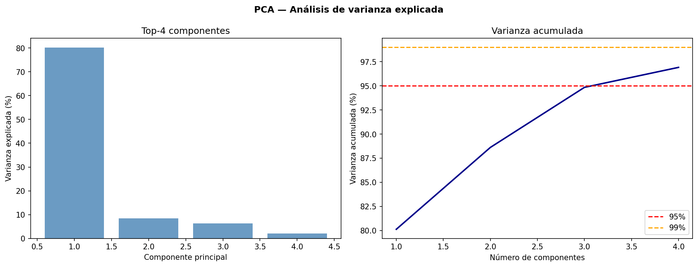
**Figura 11.** Varianza explicada acumulada por componente principal. Las primeras 4 componentes capturan $\geq 95\%$ de la varianza total.

Para alcanzar el umbral del 95 % bastan **4 componentes principales**, lo que supone una reducción de dimensionalidad efectiva del 99.6 % ($1024 \to 4$).

**UMAP.** La proyección 2D del espacio de embeddings revela dos clústeres bien separados, tanto en *train* como en *test*:

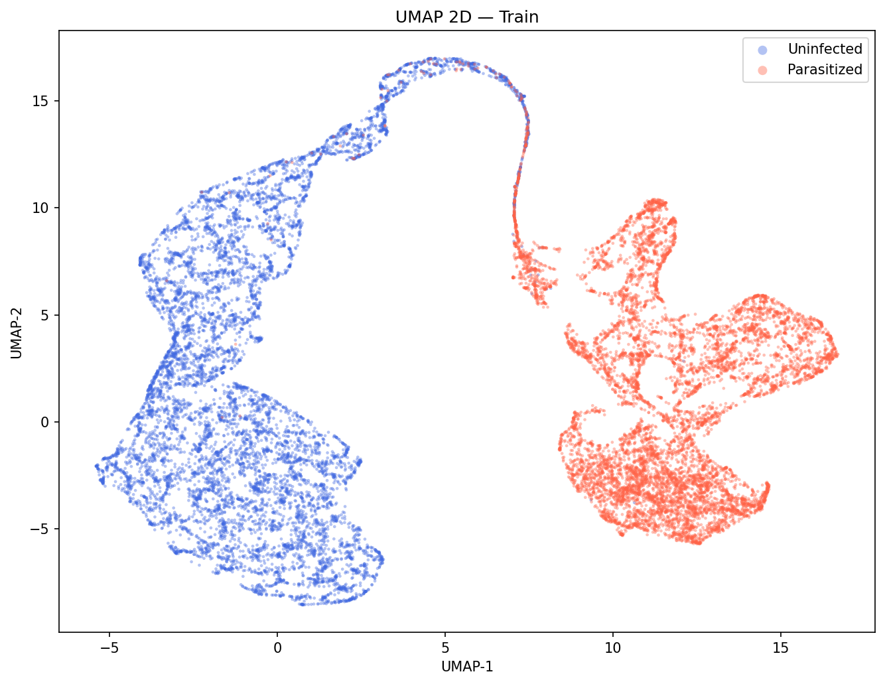
**Figura 12.** Embeddings de *train* (19 290 puntos) proyectados con UMAP ($n_{\text{neighbors}} = 15$, $\text{min\_dist} = 0.1$, métrica coseno).

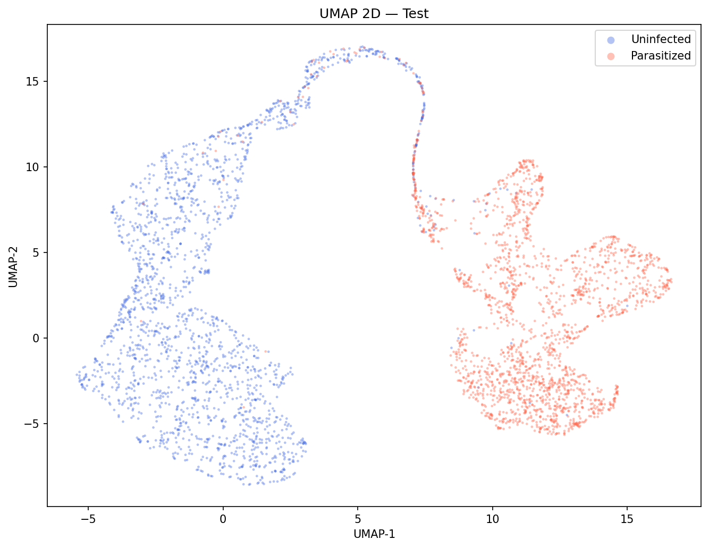
**Figura 13.** Embeddings de *test* (4 135 puntos) proyectados con UMAP. La estructura es consistente con la del conjunto de entrenamiento.

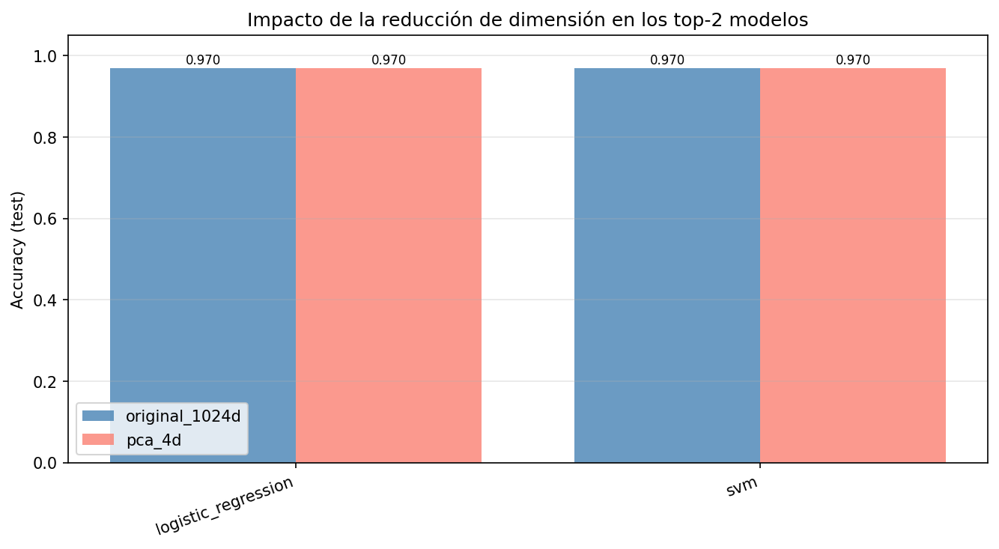
**Figura 14.** Comparación lado a lado de PCA-2D vs. UMAP-2D sobre el test. UMAP genera clústeres más compactos y mejor separados.

### 2.5 Modelos clásicos sobre embeddings de 1024 dimensiones

Los cinco modelos se ajustaron mediante `GridSearchCV` (3-fold estratificado, scoring `f1_macro`) sobre $X_{\text{trainval}}$ y se evaluaron en $X_{\text{test}}$ con IC bootstrap percentil al 95 % ($B = 200$). La Tabla 1 resume los resultados, ordenados por $F_1$-macro de test (decreciente):

**Tabla 1.** Métricas finales por modelo sobre embeddings de 1024 D. Tiempos medidos en CPU (`inference_time_s` incluye predicciones en train + val + test).

| Modelo | Train Acc | Val Acc | **Test Acc** | **Test $F_1$ macro** | Test ROC-AUC | Test BAcc | CI 95 % (Acc) | CV $F_1$ macro | Train time (s) | Inference time (s) | Hiperparámetros óptimos |
|--------|----------:|--------:|-------------:|-----:|-----:|-----:|---|----:|----:|----:|---|
| **MLP**                | 0.9883 | 0.9763 | **0.9703** | **0.9703** | **0.9932** | 0.9703 | [0.9649, 0.9758] | 0.9857 | 37.13 | 1.67 | hidden = [256], $\alpha = 10^{-4}$, $\eta_0 = 10^{-3}$ |
| **SVM** (lineal)       | 0.9903 | 0.9780 | **0.9703** | **0.9703** | n/a *      | 0.9703 | [0.9644, 0.9756] | **0.9863** | 106.76 | 8.63 | $C = 1.0$, kernel lineal, $\gamma$ = scale |
| **KNN**                | 0.9888 | 0.9756 | 0.9700 | 0.9700 | 0.9852 | 0.9700 | [0.9640, 0.9753] | 0.9850 | **20.75** | 34.72 | $k = 11$, coseno, weights = uniform |
| **Regresión logística**| 0.9899 | 0.9775 | 0.9698 | 0.9698 | 0.9931 | 0.9698 | [0.9642, 0.9753] | 0.9866 | 35.19 | **2.14** | $C = 1.0$, penalty = L2 |
| **Random Forest**      | 0.9948 | **0.9862** | 0.9688 | 0.9688 | 0.9928 | 0.9688 | [0.9635, 0.9741] | 0.9852 | 259.47 | 2.76 | $T = 100$, max\_depth = 10, min\_samples\_leaf = 2 |

\* SVM lineal con `probability = False` no produce *scores* probabilísticos, por lo que no se reporta AUC.

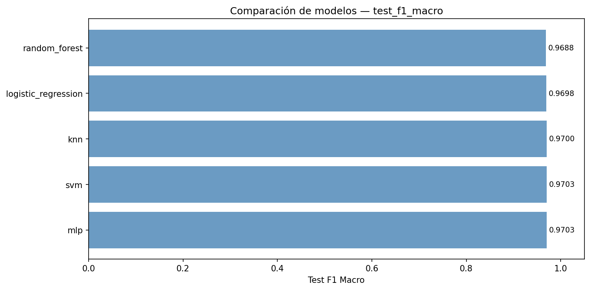
**Figura 15.** $F_1$-macro de test por modelo. El rango entre el mejor y el peor es de sólo 0.0015.

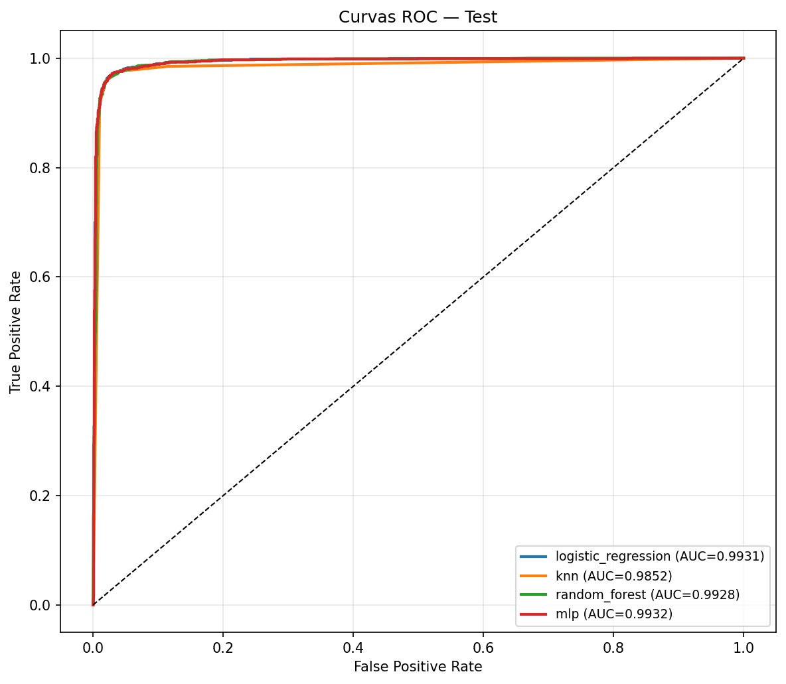
**Figura 16.** Curvas ROC en el conjunto de test para los cuatro modelos con *scores* probabilísticos. Las áreas bajo la curva son superiores a 0.985 en todos los casos.

**Matrices de confusión por modelo (test, $N = 4\,135$).**

Las tablas reproducen los conteos exactos de los JSON. Convención: filas = clase verdadera, columnas = clase predicha; positivo (1) = *Parasitized*.

*Regresión logística:*

|              | Pred = 0 | Pred = 1 |
|--------------|---------:|---------:|
| Real = 0 (Uninfected)  | 2006 | 62 |
| Real = 1 (Parasitized) |   63 | 2004 |


**Figura 17.** Matriz de confusión — Regresión logística.

*KNN ($k = 11$, coseno):*

|              | Pred = 0 | Pred = 1 |
|--------------|---------:|---------:|
| Real = 0 | 2007 | 61 |
| Real = 1 |   63 | 2004 |


**Figura 18.** Matriz de confusión — KNN.

*Random Forest:*

|              | Pred = 0 | Pred = 1 |
|--------------|---------:|---------:|
| Real = 0 | 2005 | 63 |
| Real = 1 |   66 | 2001 |

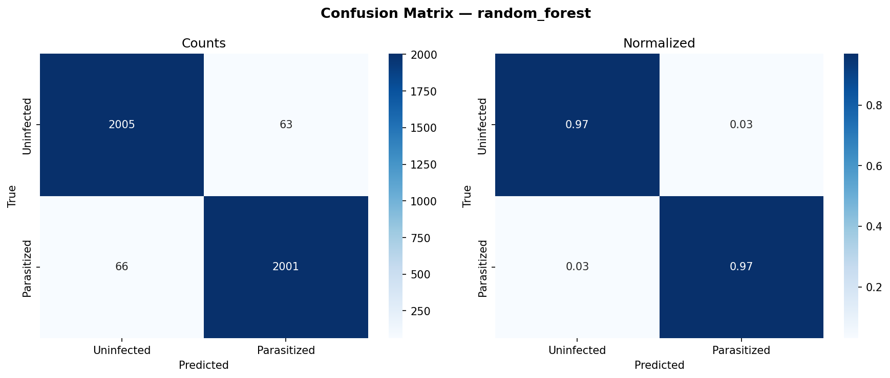
**Figura 19.** Matriz de confusión — Random Forest.

*MLP:*

|              | Pred = 0 | Pred = 1 |
|--------------|---------:|---------:|
| Real = 0 | 2009 | 59 |
| Real = 1 |   64 | 2003 |

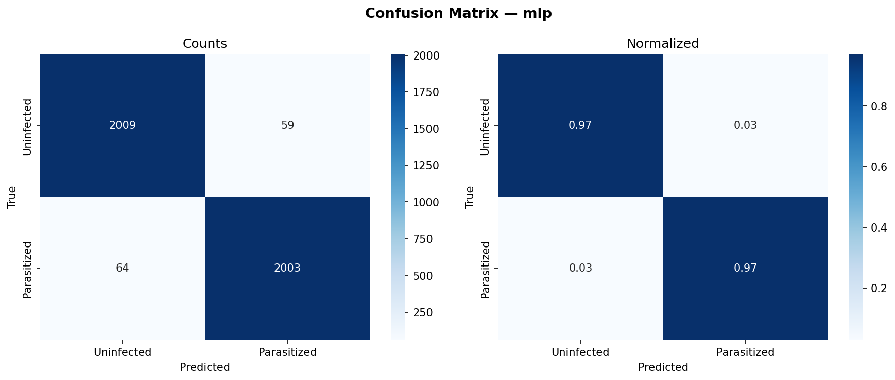
**Figura 20.** Matriz de confusión — MLP.

*SVM (kernel lineal):*

|              | Pred = 0 | Pred = 1 |
|--------------|---------:|---------:|
| Real = 0 | 2014 | 54 |
| Real = 1 |   69 | 1998 |


**Figura 21.** Matriz de confusión — SVM.

**Observaciones cuantitativas:**

- MLP y SVM empatan en Test accuracy $= 0.9703$ y $F_1$-macro $= 0.9703$. MLP tiene el mejor AUC (0.9932) y el menor tiempo de inferencia (1.67 s).
- Random Forest es el modelo con mayor `Train Acc` (0.9948) y mayor `Val Acc` (0.9862), pero el menor `Test Acc` (0.9688). La diferencia *train* $\to$ *test* es del orden de $-2.6\,\text{pp}$, el sobreajuste más pronunciado del estudio.
- La regresión logística — un modelo lineal sin capacidad de modelar interacciones — alcanza $0.9698$ de accuracy y AUC $= 0.9931$, lo que sugiere que el espacio de embeddings es **prácticamente linealmente separable**.
- KNN tiene el AUC más bajo (0.9852) pero accuracy comparable, lo que es consistente con su naturaleza no paramétrica y la métrica coseno utilizada.
- La amplitud entre el mejor y el peor $F_1$-macro de test es $0.9703 - 0.9688 = 0.0015$. Los intervalos de confianza bootstrap se solapan ampliamente entre todos los modelos, por lo que ninguna diferencia es estadísticamente significativa al 95 %.

### 2.6 Impacto de la reducción de dimensión

Para evaluar la robustez del espacio aprendido frente a una compresión extrema, los dos mejores modelos se reentrenaron sobre los embeddings proyectados a las 4 primeras componentes principales (99.6 % de reducción).

**Tabla 2.** Test accuracy antes y después de PCA-4D (`artifacts/metrics/reevaluation_reduction.json`).

| Modelo | Test Acc (1024 D) | Test Acc (PCA 4 D) | $\Delta$ |
|--------|------------------:|-------------------:|---------:|
| Regresión logística | 0.9698 | **0.9703** | **+0.0005** |
| SVM (lineal)        | 0.9703 | 0.9703 | 0.0000 |

No se observa degradación al pasar de 1024 a 4 dimensiones; la regresión logística incluso mejora marginalmente (+0.05 pp), posiblemente por un efecto de *denoising* implícito al descartar las direcciones de varianza más baja. Este resultado refuerza la observación de §2.3: la información discriminativa entre clases está concentrada en muy pocas direcciones lineales del espacio de embeddings.

### 2.7 Análisis de vecinos más cercanos

Se inspeccionaron 6 consultas representativas del test (`src/evaluation/similarity.py::find_nearest_neighbors`, $k = 5$). Los resultados completos viven en `artifacts/metrics/nearest_neighbors.json`. Algunos casos ilustrativos:

*Caso típico — query *Parasitized*, vecindario homogéneo:*

| Posición | Idx vecino | Etiqueta | Similitud coseno |
|---------:|-----------:|:--------:|------------------:|
| 1 | 2536 | 1 (Parasitized) | 0.99989 |
| 2 | 2211 | 1 | 0.99936 |
| 3 | 1271 | 1 | 0.99920 |
| 4 |  734 | 1 | 0.99917 |
| 5 | 1076 | 1 | 0.99909 |

Query idx = 2836, label = 1. Los 5 vecinos comparten etiqueta, con similitudes superiores a 0.999.

*Caso atípico — query *Parasitized* con vecinos *Uninfected*:*

| Posición | Idx vecino | Etiqueta | Similitud coseno |
|---------:|-----------:|:--------:|------------------:|
| 1 | 2249 | 0 (Uninfected) | 0.99988 |
| 2 | 1149 | 0 | 0.99971 |
| 3 | 3640 | 0 | 0.99967 |
| 4 | 2704 | 0 | 0.99957 |
| 5 | 4130 | 0 | 0.99949 |

Query idx = 3523, label = 1. Los 5 vecinos pertenecen a la clase opuesta, todos con similitud $> 0.999$. Este patrón es coherente con casos *borderline* del dataset y constituye una pista clara para auditoría manual de etiquetas o para incorporar técnicas de *label noise correction* en trabajo futuro.

En total, los 6 ejemplos muestran que la métrica coseno sobre los embeddings es altamente predictiva (la mayoría de vecindarios son homogéneos en etiqueta) pero no infalible: las falsificaciones residuales del clasificador se concentran en regiones donde varias imágenes etiquetadas como clases distintas conviven con similitud cercana a 1.

### 2.8 Comparación consolidada y resumen final

La Figura 22 sintetiza los cuatro principales indicadores de calidad sobre el test:

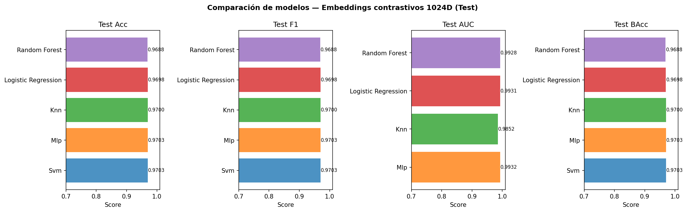
**Figura 22.** Comparación final de Test Accuracy, $F_1$-macro, ROC-AUC y Balanced accuracy entre los cinco modelos clásicos.

**Síntesis cuantitativa:**

- Todos los modelos superan **96.8 % de accuracy** y **0.985 de AUC**.
- El rango entre el mejor y el peor modelo es $\leq 0.0015$ en $F_1$-macro y $\leq 0.0080$ en AUC; los IC bootstrap se solapan completamente.
- Reducir el espacio de 1024 a 4 dimensiones mediante PCA **no degrada** la performance de los mejores modelos.
- El gap de similitud coseno intra/inter-clase es $\Delta = 0.8170$, evidencia geométrica directa de que el encoder SupCon construyó una representación discriminativa de alta calidad.

Estas observaciones, en conjunto, demuestran que (i) el aprendizaje contrastivo supervisado produce embeddings cuya capacidad de discriminación es prácticamente saturada por cualquier clasificador estadístico razonable, y (ii) la complejidad efectiva del problema, una vez transformado al espacio de embeddings, es muy baja — pocas dimensiones lineales bastan para alcanzar el rendimiento final.
